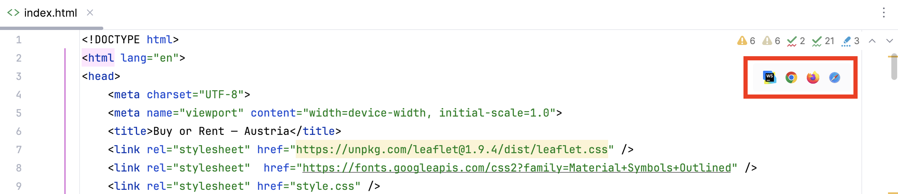

# Buying versus Renting Property for People under 30
## How to run locally (with WebStorm)

1. Clone the project
2. Install **WebStorm** from Jetbrains (https://www.jetbrains.com/webstorm/) or any other IDE that let's you deploy web-apps
3. Open the `index.html` in Webstorm and klick on the browser icon of your choice (red box), this will open the web-app in the browser you chose

## How to run locally (over the terminal)

TODO Bernhard

## Dependencies

Everything our web-app need is loaded automatically - you don't need to worry about any dependencies.
